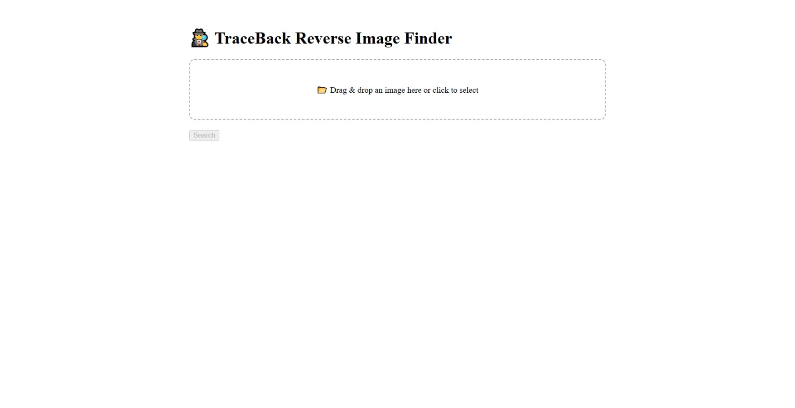
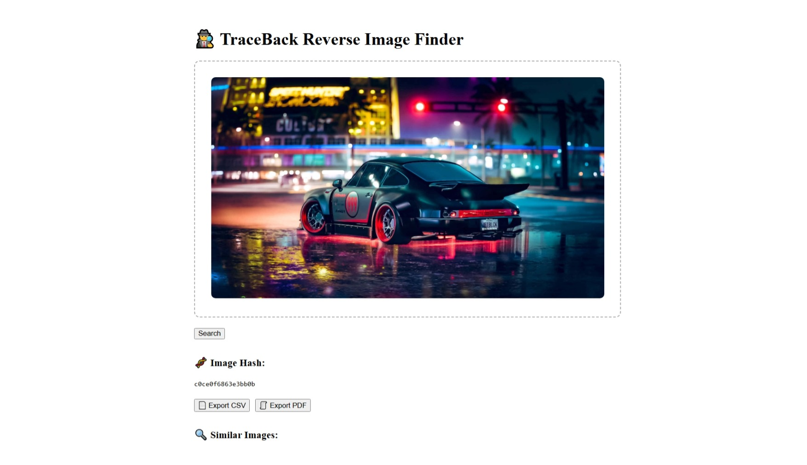

# 🕵️‍♂️ TraceBack – Reverse Image Finder

TraceBack is a full-stack web application built with **React** and **Flask** that allows you to:

- Upload an image via drag & drop or file picker
- Detect and compare it with existing images
- See visual similarity scores
- Analyze if it's AI-generated using DeepFace
- Export results to CSV or PDF

---

## 🚀 Features

- 🔍 Reverse image lookup using OpenCV feature matching (ORB)
- 🧬 Perceptual hashing for fast comparisons
- 🤖 AI image detection using DeepFace
- 📊 Visual similarity indicators
- 📁 Drag-and-drop upload
- 📤 Export results (CSV / PDF)

---

## 🖼️ Preview

### 🔼 Upload Image


### 📊 Matched Results


---

## 🧱 Tech Stack

| Frontend | Backend |
|----------|---------|
| React + Axios | Flask |
| HTML5 Drag-and-Drop | OpenCV (ORB) |
| FileSaver.js, jsPDF | DeepFace + Pillow + ImageHash |

---

## 🛠️ Installation

### 1. Clone the repo

```bash
git clone https://github.com/Nuraj250/traceback.git
cd traceback
```

---

### 2. Setup Backend (Flask)

```bash
cd backend
python -m venv venv
source venv/bin/activate  # or venv\Scripts\activate on Windows
pip install -r requirements.txt
python app.py
```

> Flask runs on: `http://localhost:5000`

Make sure you have test images in `backend/static/database/`.

---

### 3. Setup Frontend (React)

```bash
cd ../frontend
npm install
npm start
```

> React runs on: `http://localhost:3000`

---

## 📂 Folder Structure

```
traceback/
├── backend/
│   ├── app.py
│   ├── static/uploads/
│   ├── static/database/
│   ├── utils/image_search.py
├── frontend/
│   ├── src/App.jsx
│   ├── src/components/ResultCard.jsx
│   ├── public/
│   └── docs/
│       ├── screenshot-upload.png
│       └── screenshot-results.png
├── README.md
```

---

## 📤 Exports

- 📄 Click “Export CSV” to download results in `.csv`
- 🧾 Click “Export PDF” for a clean printable report

---

## 💡 Future Ideas

- Image hosting (Cloudinary / S3)
- Save user history
- Real-time similarity percentage tuning
- Mobile UI optimization

---

## 📜 License

MIT © [Your Name](https://github.com/Nuraj250)
```
